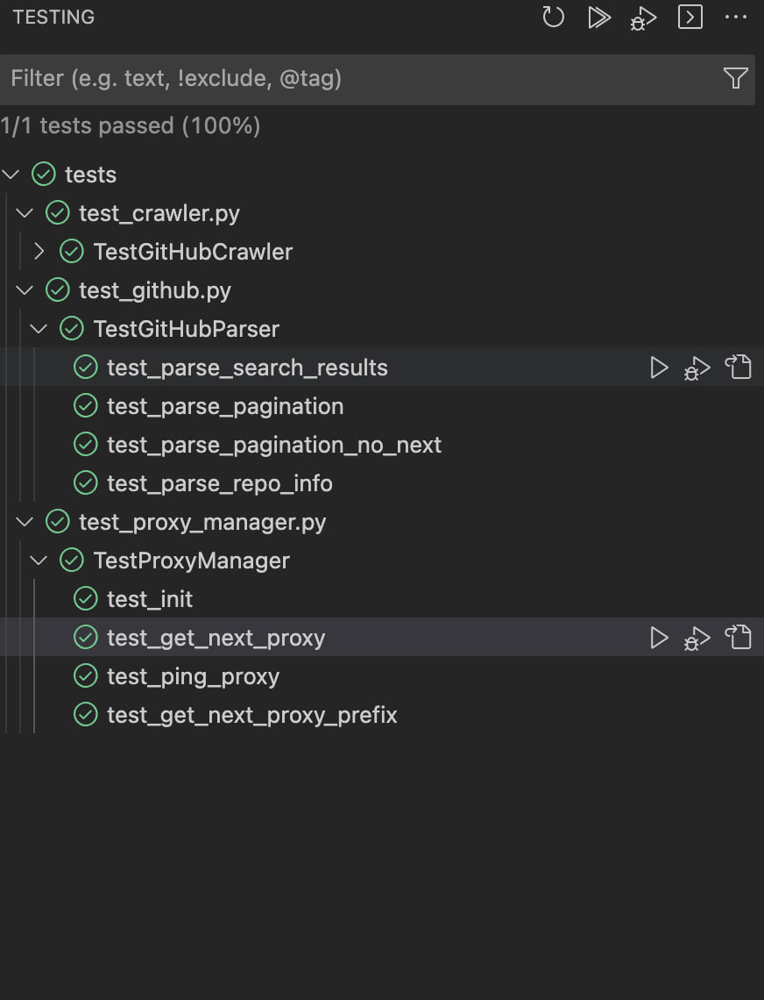

# GitHub Crawler

The GitHub Crawler is a tool designed to scrape GitHub search results and fetch information about repositories based on specified keywords and search types. Technical challenge by Red Points.

## Table of Contents

- [Features](#features)
- [Requirements](#requirements)
- [Installation](#installation)
- [Usage](#usage)
- [Configuration](#configuration)
- [Documentation](#documentation)

## Features

- Fetch search results from GitHub for repositories, issues, or wikis.
- Extract detailed information about repositories.
- Supports proxy rotation for efficient scraping.
- Asynchronous processing for faster retrieval of data.

## Requirements

- Python 3.7+
- aiohttp
- BeautifulSoup

## Installation

1. Clone the GitHub Crawler repository:

```bash
git clone https://github.com/belochenko/github-crawler.git
```

2. Navigate to the project directory:

```bash
cd github-crawler
```

3. Install the required dependencies using pip:

```bash
pip install -r requirements.txt
```

## Usage

To use the GitHub Crawler, follow these steps:

1. Ensure you have the necessary dependencies installed (see [Installation](#installation)).
2. Configure the crawler by updating the `config.json` file with your desired keywords and proxies.
3. Run the crawler using the following command:

```bash
python main.py
```

OR 

```bash
python main.py --config different_config.json
```

## Configuration

The `config.json` file contains the configuration settings for the GitHub Crawler. You can customize the following parameters:

- `keywords`: A list of keywords to search for on GitHub.
- `proxies`: A list of proxy addresses to rotate during scraping.
- `type`: The type of search to perform (e.g., repositories, issues, wikis).

## Documentation

Detailed documentation for the GitHub Crawler and its components can be found in the source code itself. Each module contains docstrings that explain its purpose, usage, and parameters.

## Testing

The project includes comprehensive unit tests to verify the functionality of key components. Tests cover:

Parsing of search results and repository information
Proxy management and rotation
Error handling and edge cases
Run the tests using the following command:

```bash
python -m unittest discover tests
```

